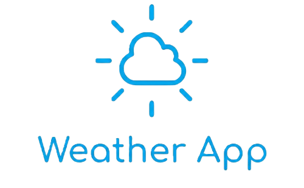

<p align="center">
  
</p>

<div align="center">

[](https://github.com/HenriqueRamos00/ESP32-Weather/actions/workflows/docker-publish-backend.yml)
[](https://github.com/HenriqueRamos00/ESP32-Weather/actions/workflows/docker-publish-frontend.yml)

</div>

# ESP32 Weather (IoT Dashboard)

An application to **receive sensor data via HTTP** from ESP32/IoT devices and **visualize it on a web dashboard**.  
Includes device management, API-key authentication, and real-time telemetry dashboards.

---

## Features

- **API Key Authentication** — Secure device identification and authorization
- **Device Management** — Add, monitor, and manage devices through the web interface
- **Real-time Dashboards** — Visualize collected sensor data with charts and summaries
- **HTTP API** — Simple endpoint for IoT devices to send sensor readings
- **User Management** — Role-based access (admins and dashboard-only users)

---

## Repository Structure

```
├── backend/        # API server (authentication, data ingestion, device management)
├── frontend/       # Web dashboard (UI, charts, device management)
├── example/        # Example deployment files (docker-compose.yml, .env.example)
└── .github/        # GitHub workflows and assets
```

---

## Quick Start (Docker - Recommended)

Docker images are automatically built by GitHub Actions and available on Docker Hub.

### 1) Copy Example Files

```bash
cp example/docker-compose.yml ./docker-compose.yml
cp example/.env.example ./.env
```

### 2) Configure Environment Variables

Edit `.env` and set the required variables:
- Port configurations
- Secret keys
- Database credentials
- Other application settings

### 3) Start the Application

```bash
docker compose up -d
```

### 4) Create Admin User

```bash
docker compose --profile admin run --rm -it init-admin --email admin@example.com --prompt-password
```

### 5) Access the Dashboard

Open your browser and navigate to:
- **Default URL:** `http://localhost:8081`

---

## Using the Web Dashboard

### Dashboard Tab
- Select a sensor to view collected weather data
- View 24-hour summaries and historical graphs
- Monitor real-time sensor readings

### Devices Tab
- Add new devices and generate API keys
- View device status and last-seen timestamps
- Monitor device connectivity
- **Note:** API keys are sent by devices via the `X-API-Key` header

### User Management
- **Normal Users** — Can only view dashboards and data
- **Admins** — Full access to device management and user administration

---

## API Key Authentication

Both sensor devices and display devices use API key authentication:
1. Generate an API key in the Devices tab
2. Configure your ESP32/IoT device to send the key in the `X-API-Key` HTTP header
3. Device can now securely send data to the backend